# Projektdokumentation - Smart Study Organizer 

## Inhaltsverzeichnis

1. [Ausgangslage](#1-ausgangslage)
2. [Lösungsidee](#2-lösungsidee)
3. [Vorgehen & Artefakte](#3-vorgehen--artefakte)
   - [3.1 Understand & Define](#31-understand--define)
   - [3.2 Sketch](#32-sketch)
   - [3.3 Decide](#33-decide)
   - [3.4 Prototype](#34-prototype)
   - [3.5 Validate](#35-validate)
4. [Erweiterungen](#4-erweiterungen)
5. [Projektorganisation](#5-projektorganisation)
6. [KI-Deklaration](#6-ki-deklaration)
7. [Anhang](#7-anhang)
 

## 1. Ausgangslage

Im Studium fallen laufend verschiedene Lernmaterialien wie Vorlesungsfolien, Zusammenfassungen, Notizen, Übungsaufgaben oder Präsentationen an. Diese Dateien werden häufig an unterschiedlichen Orten gespeichert, beispielsweise auf dem Desktop, im Download-Ordner, in Cloud-Speichern wie OneDrive oder direkt auf Lernplattformen wie Moodle. Dadurch wird es zunehmend schwieriger, den Überblick zu behalten und benötigte Unterlagen schnell wiederzufinden.

Der Smart Study Organizer wurde entwickelt, um dieses Problem zu lösen. Die Anwendung soll Studierenden dabei helfen, ihre Lernmaterialien zentral zu verwalten, übersichtlich zu organisieren und jederzeit schnell darauf zugreifen zu können. Durch Funktionen wie Kategorien, Favoriten, Suchmöglichkeiten und eine persönliche Benutzerverwaltung wird eine strukturierte und benutzerfreundliche Lernumgebung geschaffen.

### Problem

Studierende speichern Lernmaterialien häufig an verschiedenen Orten (Downloads, Desktop, OneDrive, Moodle usw.) und verlieren dadurch den Überblick. Das Wiederfinden wichtiger Dokumente kann zeitaufwendig sein und führt oft zu unnötigem Suchaufwand. Besonders bei mehreren Modulen und einer grossen Anzahl an Dateien wird die Organisation der Lernunterlagen zunehmend schwierig.

### Ziele

Die Anwendung verfolgt folgende Ziele:

- Lernmaterialien zentral an einem Ort verwalten
- Schnelles Wiederfinden von Dokumenten ermöglichen
- Materialien nach Fächern kategorisieren
- Wichtige Dokumente als Favoriten markieren
- Eine übersichtliche und moderne Benutzeroberfläche bereitstellen
- Die Organisation und Verwaltung von Lernunterlagen vereinfachen

### Primäre Zielgruppe

Die primäre Zielgruppe sind Studierende von Hochschulen und Universitäten, die regelmässig mit digitalen Lernmaterialien arbeiten und eine einfache Möglichkeit suchen, ihre Unterlagen strukturiert zu verwalten.

### Weitere Stakeholder

Neben den Studierenden gibt es weitere Personen und Gruppen, die indirekt von der Lösung profitieren oder am Projekt beteiligt sind:

- **Dozierende**, da Studierende Lernmaterialien effizienter organisieren und nutzen können
- **Hochschulen und Bildungseinrichtungen**, welche digitale Lernprozesse fördern
- **Testpersonen**, die im Rahmen der Evaluation Feedback zur Benutzerfreundlichkeit und Funktionalität liefern
- **Projektbetreuer und Moduldozierende**, welche die Entwicklung begleiten und bewerten


## 2. Lösungsidee

Um die Verwaltung von Lernmaterialien zu vereinfachen, wurde die Webanwendung **Smart Study Organizer** entwickelt. Die Anwendung bietet Studierenden eine zentrale Plattform, auf der sie ihre Lernunterlagen speichern, organisieren und verwalten können. Anstatt Dokumente an verschiedenen Speicherorten abzulegen, werden alle Materialien an einem Ort gesammelt und übersichtlich dargestellt.

Die Lösung kombiniert eine einfache Benutzeroberfläche mit Funktionen zur Strukturierung und schnellen Wiederauffindbarkeit von Dokumenten. Durch die persönliche Benutzerverwaltung werden die Materialien jedem Benutzer individuell zugeordnet, sodass jeder Nutzer ausschliesslich auf seine eigenen Inhalte zugreifen kann.

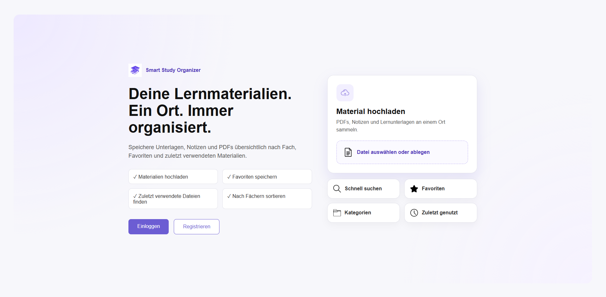

*Abbildung 1: Landing Page des Smart Study Organizers.*

### Kernfunktionalität

Die Anwendung unterstützt den gesamten Workflow von der Ablage bis zum Wiederfinden von Lernmaterialien:

- Registrierung und Login mit persönlichem Benutzerkonto
- Hochladen und Speichern von Lernmaterialien
- Verwaltung von Dokumenten mit Titel, Fach, Typ und Notizen
- Bearbeiten und Löschen bestehender Materialien
- Kategorisierung nach Fachgebieten
- Favoritenfunktion für häufig verwendete Dokumente
- Übersicht über zuletzt geöffnete Materialien
- Such- und Filterfunktion zur schnellen Navigation
- Profilverwaltung inklusive Passwortänderung
- Unterstützung eines Dark Modes für eine angenehme Nutzung bei unterschiedlichen Lichtverhältnissen

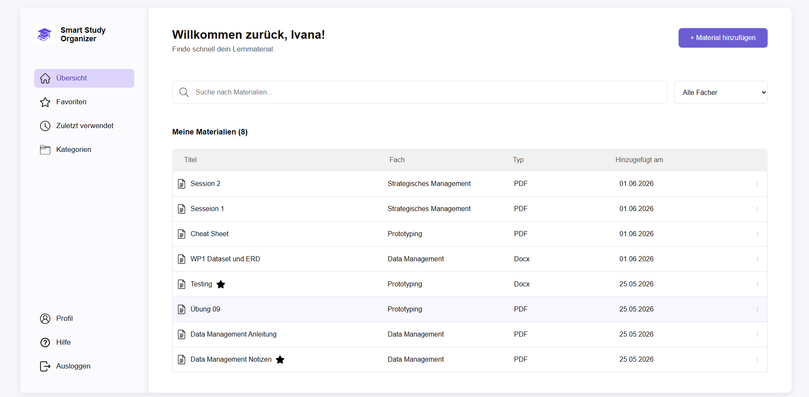

*Abbildung 2: Übersicht der gespeicherten Lernmaterialien.*

### Annahmen

Bei der Entwicklung wurden folgende Annahmen getroffen:

- Studierende bevorzugen eine zentrale Verwaltung ihrer Lernmaterialien.
- Eine einfache und übersichtliche Benutzeroberfläche erhöht die Akzeptanz der Anwendung.
- Kategorien und Favoriten erleichtern das Wiederfinden wichtiger Dokumente.
- Die Mehrheit der Benutzer arbeitet hauptsächlich mit digitalen Dokumenten wie PDFs, Präsentationen und Word-Dateien.
- Ein persönlicher Login erhöht die Sicherheit und ermöglicht eine individuelle Verwaltung der Inhalte.

### Abgrenzung

Die folgenden Funktionen sind bewusst nicht Bestandteil des aktuellen Projektumfangs:

- Gemeinsame Nutzung von Materialien zwischen mehreren Benutzern
- Mobile App für iOS oder Android
- Passwort-Reset per E-Mail
- KI-basierte Suche oder automatische Kategorisierung
- Synchronisation mit externen Lernplattformen wie Moodle
- Echtzeit-Zusammenarbeit mehrerer Benutzer
- Erweiterte Dokumentenvorschau direkt im Browser

## 3. Vorgehen & Artefakte

Die Entwicklung des Smart Study Organizers erfolgte nach dem Design-Thinking-Prozess. Dabei wurde das Projekt schrittweise von der Problemidentifikation über die Ideenfindung und Konzeption bis hin zur Umsetzung und Evaluation entwickelt. Jede Phase hatte das Ziel, die Bedürfnisse der Zielgruppe besser zu verstehen und die Lösung kontinuierlich zu verfeinern.

Im Folgenden werden die wichtigsten Aktivitäten, Entscheidungen und Ergebnisse der einzelnen Phasen dokumentiert.

### 3.1 Understand & Define

Zu Beginn des Projekts wurde das Problem analysiert, mit dem viele Studierende im Studienalltag konfrontiert sind. Lernmaterialien wie Vorlesungsfolien, Zusammenfassungen, Übungsaufgaben oder Notizen werden häufig an unterschiedlichen Orten gespeichert. Dazu gehören beispielsweise lokale Ordner, Cloud-Speicher wie OneDrive oder Lernplattformen wie Moodle. Mit zunehmender Anzahl von Modulen und Dokumenten wird es schwieriger, den Überblick zu behalten und benötigte Dateien schnell wiederzufinden.

Im Rahmen der Problemraumanalyse wurde untersucht, welche Herausforderungen bei der Organisation digitaler Lernunterlagen auftreten und welche Funktionen eine mögliche Lösung bieten sollte. Der Fokus lag dabei auf einer einfachen, zentralen und benutzerfreundlichen Verwaltung von Lernmaterialien.

#### Zielgruppenverständnis

Die primäre Zielgruppe sind Studierende von Hochschulen und Universitäten, die regelmässig mit digitalen Lernunterlagen arbeiten. Dabei wurde folgende Proto-Persona definiert:

**Persona:**

- Name: Anna, 22 Jahre
- Studium: Wirtschaftsinformatik
- Nutzt täglich digitale Lernmaterialien
- Speichert Dokumente auf verschiedenen Plattformen
- Verliert häufig Zeit beim Suchen von Unterlagen
- Wünscht sich eine zentrale und übersichtliche Lösung zur Verwaltung ihrer Materialien

#### Wesentliche Erkenntnisse

- Lernmaterialien werden an unterschiedlichen Orten gespeichert.
- Studierende verlieren häufig Zeit bei der Suche nach Dokumenten.
- Eine zentrale Ablage verbessert die Übersichtlichkeit.
- Kategorien erleichtern die Organisation von Unterlagen.
- Favoriten ermöglichen einen schnelleren Zugriff auf wichtige Dokumente.
- Eine Suchfunktion wird als hilfreich wahrgenommen.
- Eine einfache und intuitive Benutzeroberfläche ist entscheidend für die Akzeptanz der Anwendung.
- Eine persönliche Benutzerverwaltung erhöht die Sicherheit und Privatsphäre der Daten.

### 3.2 Sketch

In der Sketch-Phase wurden verschiedene Ideen für den Aufbau der Anwendung entwickelt und visualisiert. Ziel war es, eine möglichst übersichtliche und intuitive Benutzeroberfläche zu gestalten, welche die Verwaltung von Lernmaterialien vereinfacht. Dabei wurden unterschiedliche Layouts und Navigationskonzepte betrachtet und miteinander verglichen.

#### Variantenüberblick

Für die Anwendung wurden verschiedene Ansätze für die Navigation und Darstellung der Lernmaterialien untersucht:

- Dashboard mit Kartenansicht
- Dashboard mit Tabellenansicht
- Navigation über obere Menüleiste
- Navigation über eine permanente Sidebar
- Direkte Dateiverwaltung auf einer einzelnen Seite
- Aufteilung der Funktionen auf mehrere spezialisierte Seiten

Die verschiedenen Varianten wurden hinsichtlich Übersichtlichkeit, Benutzerfreundlichkeit und Erweiterbarkeit bewertet.

#### Skizzen

**Varianten-Ansatz 1: Dashboard**

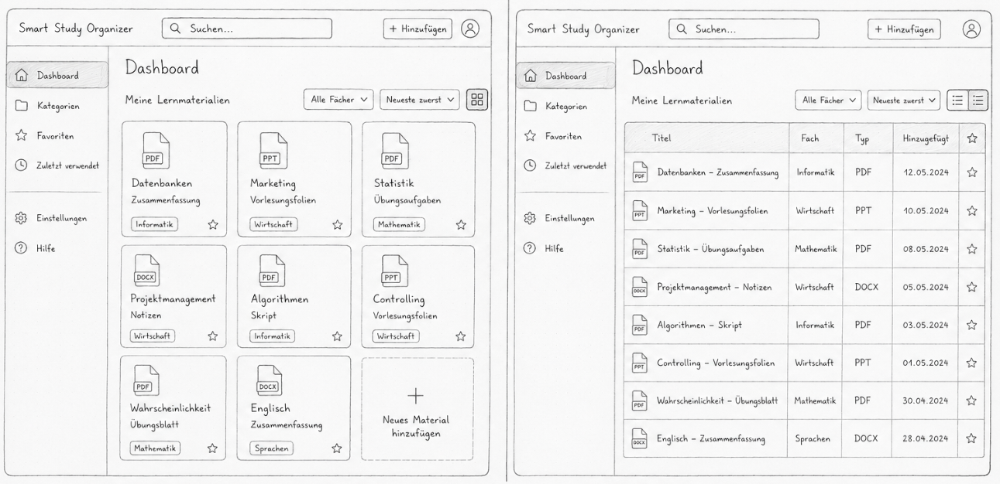

*Abbildung 3: Variante des Dashboards*

Die erste Dashboard-Variante setzt auf eine kartenbasierte Darstellung der Lernmaterialien. Jedes Dokument wird als eigene Karte dargestellt und zeigt die wichtigsten Informationen direkt an. Dadurch wirkt die Oberfläche modern und visuell ansprechend.

Im Vergleich zur Tabellenansicht liegt der Fokus stärker auf der optischen Darstellung der Inhalte. Bei einer grösseren Anzahl von Lernmaterialien kann die Übersicht jedoch schnell verloren gehen, da weniger Informationen gleichzeitig sichtbar sind.


**Varianten-Ansatz 2: Navigation**

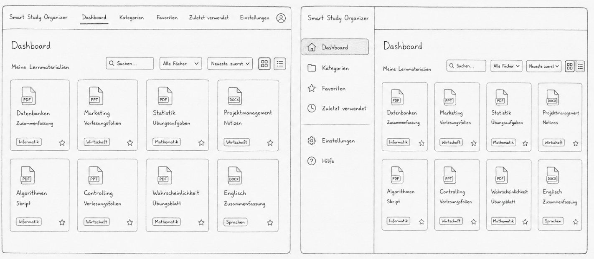

*Abbildung 4: Variante der Navigation*

In dieser Variante wurde eine horizontale Navigationsleiste im oberen Bereich der Anwendung verwendet. Alle Hauptfunktionen sind über die obere Menüleiste erreichbar.

Im Vergleich zur Sidebar-Navigation benötigt diese Lösung weniger Platz auf dem Bildschirm. Gleichzeitig wird die Navigation bei einer wachsenden Anzahl von Funktionen jedoch unübersichtlicher, da nur begrenzt Platz für weitere Menüpunkte vorhanden ist.


**Varianten-Ansatz 3: Lernmaterialien**

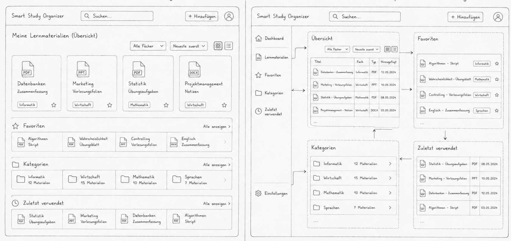

*Abbildung 5: Variante der Lernmaterialien*

Die erste Variante sah vor, sämtliche Funktionen wie Übersicht, Favoriten, Kategorien und zuletzt verwendete Materialien auf einer einzigen Seite darzustellen. Dadurch wären alle Informationen zentral verfügbar gewesen.

Die alternative Variante teilte die Funktionen auf mehrere spezialisierte Seiten auf. Jede Seite konzentriert sich dabei auf einen bestimmten Anwendungsfall, beispielsweise die Anzeige von Favoriten, Kategorien oder zuletzt verwendeten Materialien.


### 3.3 Decide

In der Decide-Phase wurden die in den vorherigen Schritten entwickelten Varianten bewertet und miteinander verglichen. Ziel war es, die Lösung auszuwählen, welche die Anforderungen der Zielgruppe am besten erfüllt und gleichzeitig eine einfache sowie intuitive Bedienung ermöglicht. Die Entscheidung basierte insbesondere auf den Kriterien Übersichtlichkeit, Benutzerfreundlichkeit, Skalierbarkeit und Effizienz bei der Verwaltung einer grösseren Anzahl von Lernmaterialien.

#### Gewählte Variante & Begründung

Für die Umsetzung des Smart Study Organizers wurde eine Kombination aus einer permanenten Sidebar-Navigation, einer tabellarischen Darstellung der Lernmaterialien sowie mehreren spezialisierten Seiten gewählt.

Die Entscheidung fiel auf diese Variante, da sie gegenüber den anderen Ansätzen mehrere Vorteile bietet:

- Die Sidebar-Navigation ermöglicht einen schnellen Zugriff auf alle Hauptfunktionen.
- Die Navigation bleibt jederzeit sichtbar und erleichtert die Orientierung innerhalb der Anwendung.
- Die Tabellenansicht bietet auch bei einer grossen Anzahl von Lernmaterialien eine gute Übersicht.
- Funktionen wie Favoriten, Kategorien und zuletzt verwendete Materialien können klar voneinander getrennt dargestellt werden.
- Die Anwendung bleibt auch bei zukünftigen Erweiterungen gut skalierbar.
- Die Benutzeroberfläche wirkt aufgeräumt und reduziert die kognitive Belastung der Nutzer.

Durch diese Kombination wird das Hauptziel der Anwendung – das schnelle Wiederfinden und Verwalten von Lernmaterialien – bestmöglich unterstützt.

#### End-to-End-Ablauf

Der typische Nutzungsvorgang eines Studierenden innerhalb der Anwendung lässt sich wie folgt beschreiben:

1. Der Nutzer meldet sich an der Anwendung an.
2. Nach dem Login gelangt er zur Übersicht seiner Lernmaterialien.
3. Neue Dokumente können über die Funktion **„Material hinzufügen“** hochgeladen werden.
4. Die Materialien werden automatisch gespeichert und in der Übersicht angezeigt.
5. Über die Suchfunktion oder die Kategorien kann gezielt nach Dokumenten gesucht werden.
6. Wichtige Dokumente können als Favoriten markiert werden.
7. Geöffnete Dokumente erscheinen automatisch im Bereich **„Zuletzt verwendet“**.
8. Materialien können jederzeit bearbeitet, ersetzt oder gelöscht werden.
9. Der Nutzer kann sein Profil verwalten und die Darstellung zwischen Light- und Dark-Mode wechseln.

#### User Journey Map

| Phase | Aktion des Nutzers | Ziel |
|---------|---------|---------|
| Einstieg | Anmeldung | Zugriff auf persönliche Materialien |
| Übersicht | Materialien anzeigen | Überblick erhalten |
| Hochladen | Neues Material hinzufügen | Dokument speichern |
| Verwalten | Material bearbeiten oder löschen | Informationen aktuell halten |
| Organisieren | Favoriten setzen und Kategorien nutzen | Schnellere Wiederfindbarkeit |
| Nutzung | Dokument öffnen | Lernen mit den Unterlagen |
| Rückkehr | Zuletzt verwendete Materialien anzeigen | Weiterarbeiten ohne erneute Suche |

#### Mockup

Für die Ausarbeitung des High-Fidelity-Prototyps wurde Figma verwendet.

**Interaktiver Figma-Prototyp:**

[Smart Study Organizer Mockup](https://www.figma.com/proto/jx8dT8kPqwVUedgJDSohpf/Prototyping--Smart-Study-Organizer-Mockup?node-id=1-2&p=f&t=GBw77Fpgi7adbnCU-1&scaling=min-zoom&content-scaling=fixed&page-id=0%3A1&starting-point-node-id=1%3A2)

Die wichtigsten Mockup-Seiten sind nachfolgend dokumentiert.

##### Dashboard / Übersicht

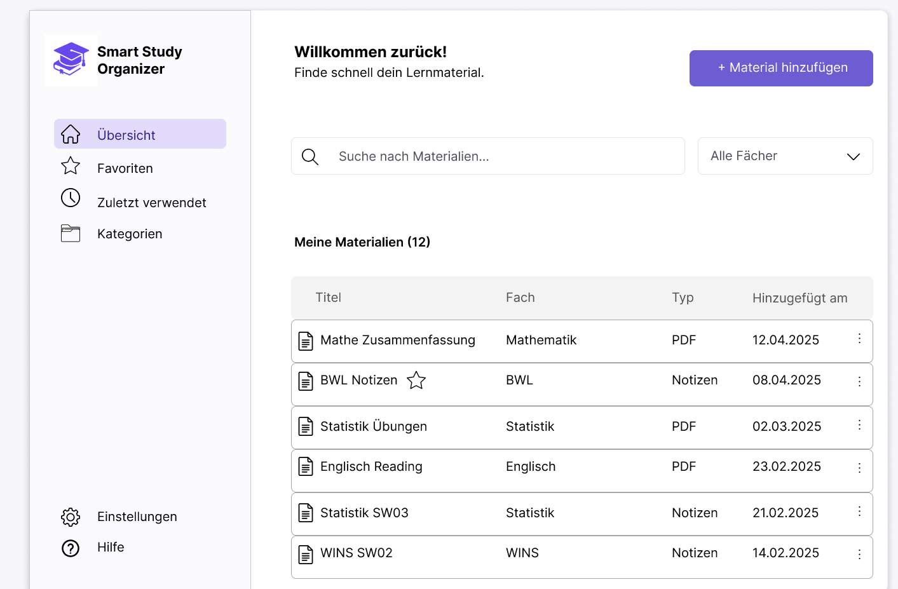

*Abbildung 6: Übersicht aller Lernmaterialien.*

Das Dashboard bildet die zentrale Arbeitsoberfläche der Anwendung. Nutzer erhalten hier einen Überblick über alle gespeicherten Lernmaterialien und können diese durchsuchen oder filtern.

##### Material hinzufügen

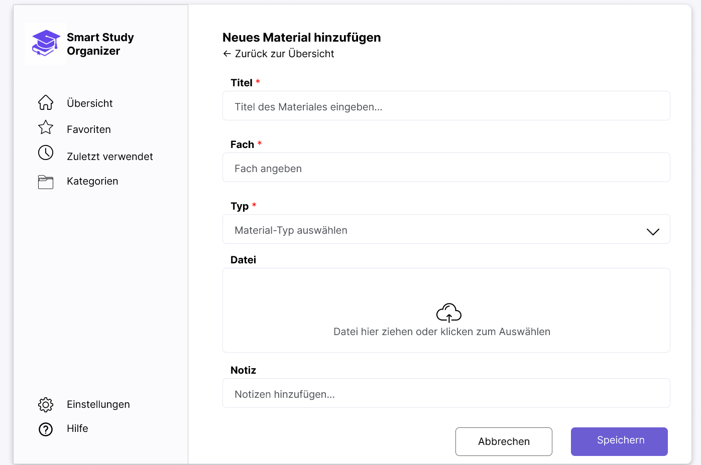

*Abbildung 7: Formular zum Hochladen neuer Lernmaterialien.*

Über diese Ansicht können neue Lernmaterialien hochgeladen und mit zusätzlichen Informationen wie Fach oder Notizen versehen werden.

##### Materialdetails

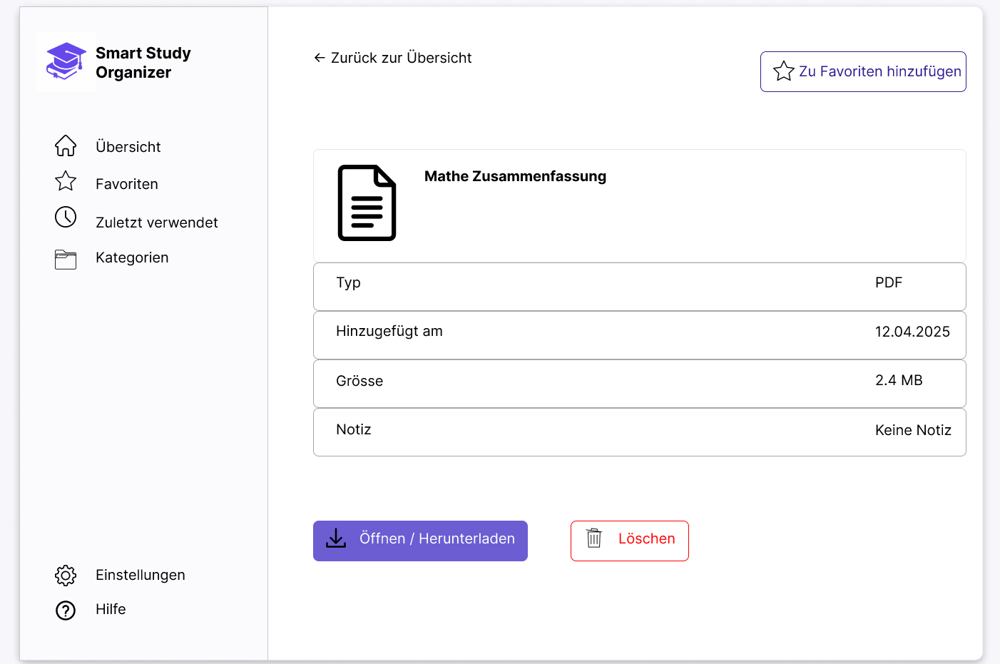

*Abbildung 8: Detailansicht eines Lernmaterials.*

Die Detailansicht zeigt alle Informationen eines Dokuments und ermöglicht das Öffnen, Bearbeiten oder Löschen.


### 3.4 Prototype

In der Prototype-Phase wurde die zuvor entwickelte Lösung als funktionsfähiger digitaler Prototyp umgesetzt. Im Gegensatz zum Mockup stand dabei nicht mehr nur die visuelle Gestaltung im Vordergrund, sondern die tatsächliche Interaktion mit der Anwendung. Nutzer können Lernmaterialien hochladen, verwalten, bearbeiten, kategorisieren und wiederfinden. Ziel des Prototyps war es, die zentralen Funktionen der Anwendung realitätsnah abzubilden und für spätere Tests nutzbar zu machen.

#### 3.4.1 Entwurf (Design)

Der Prototyp wurde mit Fokus auf Übersichtlichkeit, einfache Bedienung und schnelle Auffindbarkeit von Lernmaterialien gestaltet. Alle wichtigen Funktionen sollten mit möglichst wenigen Klicks erreichbar sein und eine konsistente Benutzererfahrung bieten.

##### Informationsarchitektur

Die Anwendung ist in mehrere klar getrennte Bereiche aufgeteilt. Dadurch können Nutzer gezielt auf die benötigten Funktionen zugreifen, ohne von unnötigen Informationen abgelenkt zu werden.

Die Hauptnavigation erfolgt über eine permanente Sidebar auf der linken Seite. Von dort aus können folgende Bereiche aufgerufen werden:

- Übersicht (Dashboard)
- Favoriten
- Zuletzt verwendet
- Kategorien
- Profil
- Hilfe
- Logout

Die Struktur orientiert sich an den typischen Arbeitsabläufen von Studierenden. Häufig verwendete Funktionen sind direkt erreichbar und die Navigation bleibt jederzeit sichtbar.

##### User Interface Design

Bei der Gestaltung der Benutzeroberfläche stand die Benutzerfreundlichkeit im Mittelpunkt. Die Anwendung richtet sich an Studierende, welche ihre Lernmaterialien möglichst effizient verwalten und wiederfinden möchten. Aus diesem Grund wurde bewusst auf eine übersichtliche Struktur, klare Navigationselemente und eine reduzierte visuelle Gestaltung geachtet.

Die Benutzeroberfläche wurde schlicht und modern gestaltet, um die Aufmerksamkeit auf die eigentlichen Inhalte – die Lernmaterialien – zu lenken. Unnötige Designelemente wurden vermieden, sodass Nutzer ihre Dokumente schnell finden und verwalten können. Gleichzeitig sorgen eine konsistente Farbgebung, wiederkehrende Bedienelemente und eine klare Seitenstruktur für eine intuitive Bedienung.

Besonderer Wert wurde darauf gelegt, häufig genutzte Funktionen wie das Hochladen, Suchen, Filtern oder Favorisieren von Lernmaterialien mit möglichst wenigen Interaktionen erreichbar zu machen. Ergänzend wurde ein Dark Mode integriert, um unterschiedlichen Nutzerpräferenzen gerecht zu werden und die Anwendung auch bei längerer Nutzung angenehm bedienbar zu halten.

Die folgenden Screens zeigen die wichtigsten Bereiche von Smart Study Organizer.

##### Landing Page


*Abbildung 9: Landing Page*

Die Landing Page bildet den Einstiegspunkt der Anwendung für nicht angemeldete Nutzer. Sie stellt die wichtigsten Funktionen des Smart Study Organizers vor und bietet direkten Zugriff auf die Registrierung und den Login. Ziel der Seite ist es, den Nutzen der Anwendung verständlich zu kommunizieren und neue Nutzer zur Verwendung der Plattform zu motivieren.

---

##### Login & Registrierung

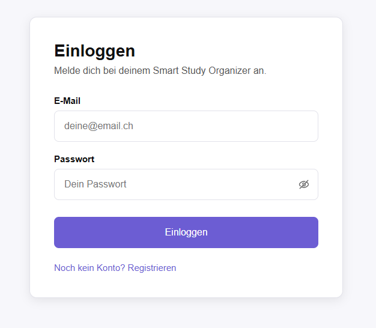

*Abbildung 10: Loginseite von Smart Study Organizer*

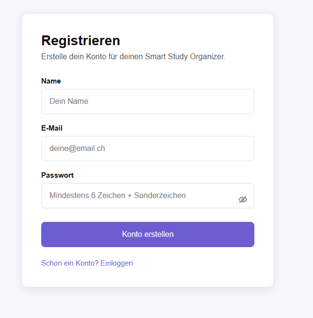

*Abbildung 11: Registrierungsseite von Smart Study Organizer*

Über die Login- und Registrierungsseiten können Benutzer ein persönliches Konto erstellen oder sich mit bestehenden Zugangsdaten anmelden. Die Registrierung beinhaltet eine Passwortvalidierung, welche Mindestanforderungen an die Passwortsicherheit überprüft.

---

##### Dashboard


*Abbildung 12: Dashboard von Smart Study Organizer*

Das Dashboard dient als zentrale Arbeitsoberfläche. Nutzer erhalten einen Überblick über alle gespeicherten Lernmaterialien. Zusätzlich stehen eine Suchfunktion, Filtermöglichkeiten sowie der direkte Zugriff auf das Hochladen neuer Materialien zur Verfügung.

---

##### Materialdetails

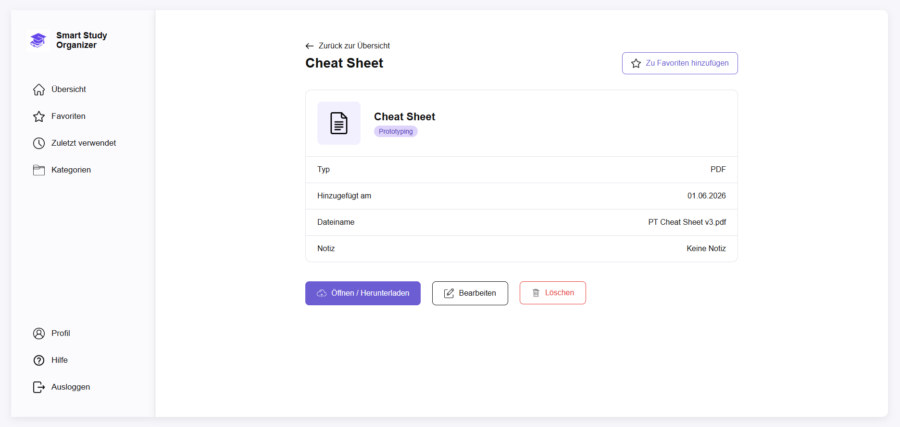

*Abbildung 13: Detailansicht eines Lernmaterials.*

In der Detailansicht werden sämtliche Informationen eines Dokuments angezeigt. Materialien können geöffnet, heruntergeladen, bearbeitet, gelöscht oder als Favorit markiert werden.

---

##### Favoriten

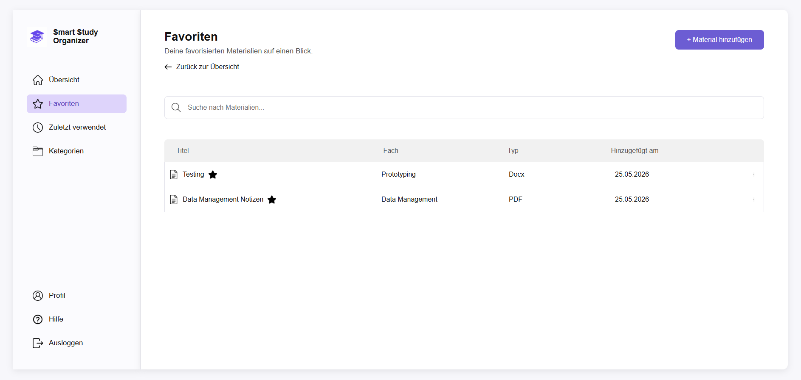

*Abbildung 14: Favoritenansicht von Smart Study Organizer*

Die Favoritenansicht ermöglicht den schnellen Zugriff auf Lernmaterialien, die als Favoriten gespeichert wurden. Nutzer können Dokumente als Favoriten markieren und diese gesammelt auf einer separaten Seite anzeigen lassen. Dadurch lassen sich wichtige Unterlagen schneller wiederfinden.

---

##### Zuletzt verwendet

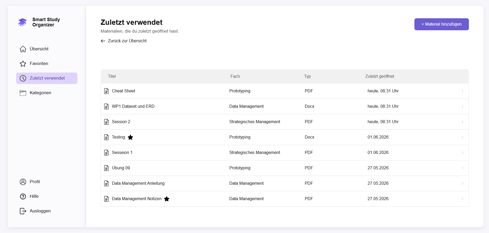

*Abbildung 15: Ansicht der zuletzt verwendeten Lernmaterialien.*

In diesem Bereich werden zuletzt geöffnete Dokumente angezeigt. Dadurch können Nutzer schnell zu Materialien zurückkehren, mit denen sie kürzlich gearbeitet haben, ohne erneut danach suchen zu müssen.

---

##### Kategorien

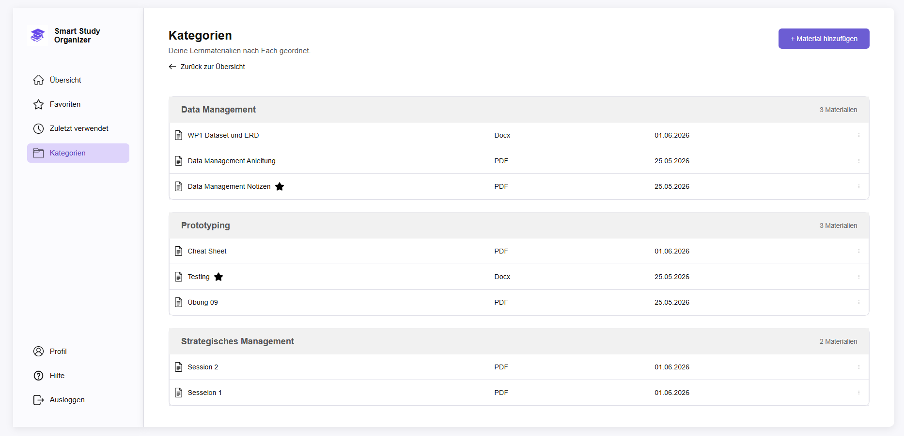

*Abbildung 16: Kategorienansicht von Smart Study Organizer*

Die Kategorienansicht gruppiert Lernmaterialien nach Fachgebieten. Nutzer erhalten dadurch eine strukturierte Übersicht über ihre Unterlagen und können Dokumente gezielt innerhalb eines bestimmten Fachbereichs finden.

---

##### Profilseite

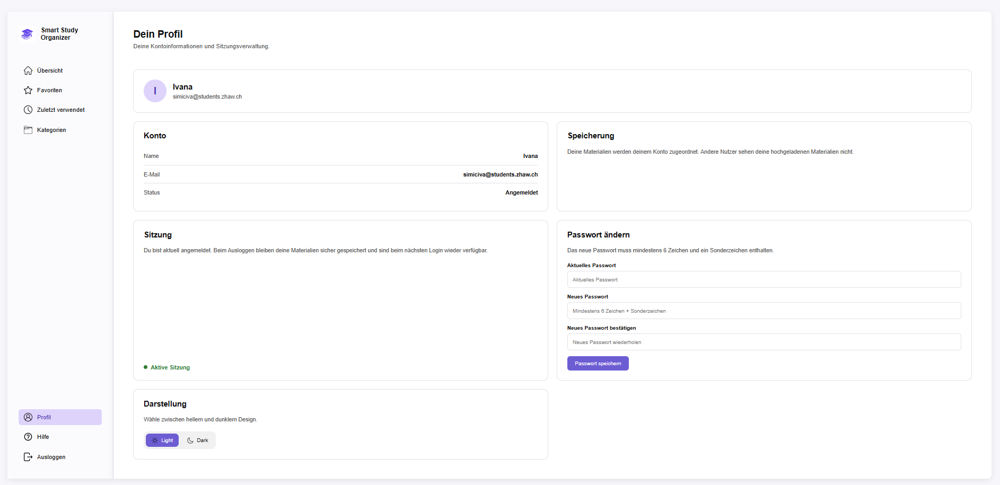

*Abbildung 17: Profilseite von Smart Study Organizer*

Die Profilseite ermöglicht die Verwaltung persönlicher Einstellungen. Nutzer können ihr Passwort ändern, zwischen Light- und Dark-Mode wechseln sowie ihre Kontoinformationen einsehen.

---

##### Hilfe-Seite

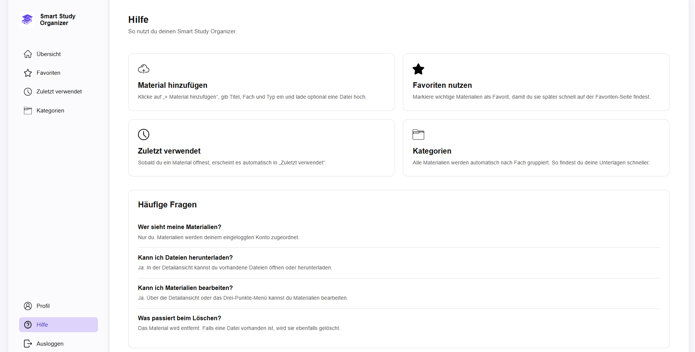

*Abbildung 18: Hilfeseite von Smart Study Organizer*

Die Hilfeseite erklärt die wichtigsten Funktionen der Anwendung und unterstützt neue Nutzer beim Einstieg.

---

##### Designentscheidungen

Während der Entwicklung wurden verschiedene Designentscheidungen getroffen, um die Benutzerfreundlichkeit zu verbessern.

- Verwendung einer permanenten Sidebar-Navigation für eine schnelle Orientierung.
- Einsatz einer Tabellenansicht zur übersichtlichen Darstellung vieler Lernmaterialien.
- Klare Trennung der Funktionen auf verschiedene Seiten, um die Informationsdichte zu reduzieren.
- Integration einer Suchfunktion und Kategorien zur schnelleren Wiederfindbarkeit von Dokumenten.
- Unterstützung eines Light- und Dark-Modes, um unterschiedliche Nutzerpräferenzen zu berücksichtigen.
- Konsistente Farbgestaltung mit einer violetten Akzentfarbe zur Hervorhebung wichtiger Aktionen.
- Responsive Gestaltung, damit die Anwendung auf verschiedenen Bildschirmgrössen nutzbar bleibt.

Die getroffenen Designentscheidungen orientieren sich an den Anforderungen der Zielgruppe und unterstützen das Ziel, Lernmaterialien möglichst effizient zu organisieren und wiederzufinden.


#### 3.4.2 Umsetzung (Technik)

Nach der Konzeption und Gestaltung des Prototyps wurde die Anwendung technisch umgesetzt. Dabei lag der Fokus auf einer modernen Webarchitektur, einer einfachen Erweiterbarkeit sowie einer klaren Trennung zwischen Benutzeroberfläche, Datenhaltung und Geschäftslogik.

##### Technologie-Stack

Für die Entwicklung des Smart Study Organizers wurden folgende Technologien eingesetzt:

- **SvelteKit** als Full-Stack-Webframework
- **JavaScript** für die Implementierung der Anwendungslogik
- **MongoDB Atlas** als Cloud-Datenbank
- **bcryptjs** zur sicheren Speicherung von Passwörtern
- **Cloudinary** für die Speicherung und Verwaltung hochgeladener Dateien
- **Netlify** für das Hosting und Deployment der Anwendung
- **HTML5** und **CSS3** für die Gestaltung der Benutzeroberfläche

Zusätzlich wurden verschiedene SvelteKit-Funktionen wie Server Actions, Layouts und Routing verwendet.

##### Tooling

Für die Entwicklung kamen verschiedene Werkzeuge und Plattformen zum Einsatz:

- **Visual Studio Code (VS Code)** als Entwicklungsumgebung
- **Git** zur Versionsverwaltung
- **GitHub** zur Verwaltung des Quellcodes
- **MongoDB Atlas** zur Datenhaltung
- **Cloudinary** zur Dateispeicherung
- **Netlify** für das Deployment
- **Figma** für die Erstellung von Wireframes, Mockups und Prototypen

##### Struktur & Komponenten

Die Anwendung ist modular aufgebaut und folgt der von SvelteKit vorgegebenen Projektstruktur. Die wichtigsten Verzeichnisse und Komponenten sind nachfolgend dargestellt.

```text
src
├── routes
│   ├── +page.svelte                 (Landing Page)
│   ├── login
│   ├── register
│   ├── profile
│   ├── help
│   ├── favorites
│   ├── recent
│   ├── categories
│   ├── add
│   └── materials
│       ├── [id]
│       └── [id]/edit
│
├── lib
│   ├── components
│   │   ├── ThemeToggle.svelte
│   │   ├── MaterialMenu.svelte
│   │   ├── FavoriteIcon.svelte
│   │   └── BackLink.svelte
│   │
│   ├── server
│   │   ├── auth.js
│   │   ├── cloudinary.js
│   │   ├── db.js
│   │   ├── materials.js
│   │   ├── users.js
│   │   └── upload.js
│   │
│   ├──  utils
│   │   ├── date.js
│
└── app.css
```

Die Navigation erfolgt über eine zentrale Sidebar, welche auf allen geschützten Seiten eingebunden wird. Wiederkehrende Funktionen wie die Theme-Umschaltung oder die Materialverwaltung wurden als separate Komponenten umgesetzt, um eine bessere Wartbarkeit und Wiederverwendbarkeit zu gewährleisten.

##### State Management

Für die Verwaltung von Zuständen wurden die in SvelteKit integrierten Runes und Reactive States verwendet. Dadurch können Suchbegriffe, Filtereinstellungen und Benutzerdaten dynamisch aktualisiert werden.

##### Daten & Schnittstellen

Die Daten werden in einer MongoDB-Atlas-Datenbank gespeichert. Für die Anwendung werden zwei zentrale Collections verwendet.

##### Collection: users

| Feld | Beschreibung |
|--------|-------------|
| _id| Referenz auf den Besitzer |
| name | Name des Benutzers |
| email | E-Mail-Adresse |
| passwordHash | Verschlüsseltes Passwort |
| createdAt | Zeitpunkt der Registrierung |

##### Collection: materials

| Feld | Beschreibung |
|--------|-------------|
| _id | Referenz auf den Besitzer |
| title | Titel des Lernmaterials |
| subject | Fach/Kategorie |
| type | Dokumenttyp (PDF, DOCX usw.) |
| note | Optionaler Beschreibungstext |
| fileName | Ursprünglicher Dateiname |
| filePath | Cloudinary-Dateipfad |
| fileSize | Dateigrösse |
| favorite | Favoritenstatus |
| createdAt | Erstellungsdatum |
| updatedAt | Letzte Änderung |
| lastOpened | Letzter Zugriff |

##### Datenfluss

```text
Benutzer
    │
    ▼
SvelteKit Frontend
    │
    ▼
Server Actions
    │
 ┌──┴───────────┐
 ▼              ▼
MongoDB      Cloudinary
(Material)   (Dateien)
```

Beim Hochladen eines Lernmaterials wird die Datei zuerst an Cloudinary übertragen. Die zurückgelieferte URL sowie die Metadaten des Materials werden anschliessend in MongoDB gespeichert. Beim Öffnen eines Materials werden die Informationen aus der Datenbank geladen und die Datei über Cloudinary bereitgestellt.

##### Deployment

Die Anwendung wurde über Netlify veröffentlicht und ist unter folgender URL erreichbar:

**Deployment URL:**  
https://smart-study-organizer-app.netlify.app/


##### Besondere Entscheidungen

Während der Entwicklung wurden mehrere technische Entscheidungen getroffen.

- Verwendung von MongoDB Atlas, um eine cloudbasierte Datenhaltung ohne lokale Datenbankinstallation zu ermöglichen.
- Einsatz von Cloudinary für Datei-Uploads, da lokale Dateispeicherung auf Netlify nicht dauerhaft verfügbar ist.
- Nutzung von bcryptjs, um Benutzerpasswörter sicher zu speichern.
- Umsetzung eines Dark Modes zur Verbesserung der Benutzererfahrung.
- Speicherung der Dark-Mode-Einstellung im Browser, damit die gewählte Darstellung auch nach einem erneuten Besuch erhalten bleibt.
- Aufteilung der Anwendung in mehrere spezialisierte Seiten anstelle einer einzigen komplexen Ansicht.
- Beschränkung auf die wichtigsten Funktionen eines Minimum Viable Products (MVP), um den Fokus auf die Kernprobleme der Zielgruppe zu legen.

Durch diese Architektur konnte eine einfache, wartbare und erweiterbare Anwendung realisiert werden, welche die definierten Anforderungen der Zielgruppe erfüllt.

### 3.5 Validate

In der Validate-Phase wurde der entwickelte Prototyp mit potenziellen Nutzern getestet. Ziel war es, die Benutzerfreundlichkeit der Anwendung zu überprüfen, mögliche Schwachstellen zu identifizieren und die wichtigsten Funktionen unter realistischen Bedingungen zu evaluieren.

#### URL der getesteten Version

Die Evaluation wurde mit der öffentlich bereitgestellten Anwendung durchgeführt:

**https://smart-study-organizer-app.netlify.app/**

Die getestete Version entsprach weitgehend dem aktuellen Entwicklungsstand. Nach Abschluss der Evaluation wurden jedoch einzelne technische und gestalterische Verbesserungen umgesetzt. Sofern sich Funktionen oder Ansichten gegenüber der getesteten Version verändert haben, werden diese anhand von Screenshots der damaligen Version dokumentiert.

#### Ziele der Prüfung

Im Rahmen der Evaluation sollten insbesondere folgende Fragestellungen beantwortet werden:

- Finden sich Benutzerinnen und Benutzer schnell in der Anwendung zurecht?
- Ist die Navigation verständlich und logisch aufgebaut?
- Können Lernmaterialien selbstständig hinzugefügt und verwaltet werden?
- Werden Favoriten, Kategorien und zuletzt verwendete Materialien verstanden?
- Sind Icons, Buttons und Fehlermeldungen verständlich?
- Funktionieren Suche und Filterung intuitiv?
- Wird der Dark Mode als angenehm und gut lesbar wahrgenommen?
- Wirkt die Anwendung modern, übersichtlich und benutzerfreundlich?

#### Vorgehen

Die Evaluation wurde als moderierter Vor-Ort-Test durchgeführt welcher lokal am Laptop getestet wurde. Die Testpersonen erhielten vorbereitete Aufgaben und konnten die Anwendung selbstständig bedienen. Während der Durchführung wurden Beobachtungen festgehalten und anschliessend Feedback zur Benutzerfreundlichkeit gegeben.

#### Stichprobe

Die Anwendung wurde mit zwei Studierenden aus dem Studiengang Wirtschaftsinformatik getestet.

##### TP-01

| Merkmal | Beschreibung |
|----------|-------------|
| Studiengang | Wirtschaftsinformatik |
| Alter | 20–25 Jahre |
| Gerät | Laptop |
| Browser | Google Chrome |

##### TP-02

| Merkmal | Beschreibung |
|----------|-------------|
| Studiengang | Wirtschaftsinformatik |
| Alter | 20–25 Jahre |
| Gerät | Laptop |
| Browser | Google Chrome |

#### Aufgaben / Szenarien

| Nr. | Aufgabe |
|------|----------|
| A1 | Landing Page betrachten und Zweck der Anwendung beschreiben |
| A2 | Registrierung durchführen |
| A3 | Login durchführen |
| A4 | Neues Lernmaterial hinzufügen |
| A5 | Lernmaterial öffnen |
| A6 | Lernmaterial bearbeiten |
| A7 | Lernmaterial löschen |
| A8 | Material als Favorit markieren |
| A9 | Nach einem Material suchen |
| A10 | Kategorien verwenden |
| A11 | Zuletzt verwendete Materialien aufrufen |
| A12 | Profilseite öffnen und Dark Mode testen |
| A13 | Registrierung mit zu schwachem Passwort versuchen |
| A14 | Login mit falschem Passwort durchführen |
| A15 | Login mit nicht existierender E-Mail durchführen |
| A16 | Material ohne Pflichtfelder speichern |
| A17 | PDF auswählen und anschliessend eine DOCX-Datei hochladen |
| A18 | DOCX auswählen und anschliessend eine PDF-Datei hochladen |
| A19 | Passwortänderung mit ungültigem Passwort testen |
| A20 | Suche nach einem nicht existierenden Material durchführen |
| A21 | Favorit hinzufügen und anschliessend wieder entfernen |
| A22 | Material bearbeiten und eine neue Datei hochladen |
| A23 | Material löschen und prüfen, ob es aus der Übersicht verschwindet |
| A24 | Dark Mode aktivieren und Seite neu laden |

#### Kennzahlen & Beobachtungen

Zur Bewertung des Prototyps wurden sowohl quantitative als auch qualitative Kriterien berücksichtigt. Die quantitative Auswertung basiert auf der erfolgreichen Durchführung der definierten Testaufgaben durch die beiden Testpersonen. Ergänzend wurden Beobachtungen zum Nutzerverhalten, zur Verständlichkeit der Benutzeroberfläche sowie zur allgemeinen Benutzerfreundlichkeit festgehalten.

##### Erfolgsquote

| Bereich | Erfolgsquote |
|----------|-------------|
| Landing Page verstehen | 2 / 2 |
| Registrierung | 2 / 2 |
| Passwortvalidierung | 2 / 2 |
| Login | 2 / 2 |
| Fehlereingaben beim Login | 2 / 2 |
| Navigation | 2 / 2 |
| Suche und Filter | 2 / 2 |
| Favoriten verwenden | 2 / 2 |
| Kategorien verwenden | 2 / 2 |
| Zuletzt verwendet | 2 / 2 |
| Profilseite | 2 / 2 |
| Dark Mode | 2 / 2 |
| Passwortänderung | 2 / 2 |
| Material bearbeiten | 2 / 2 |
| Material löschen | 2 / 2 |
| Dateiformat-Prüfung | 2 / 2 |
| Material hochladen | 0 / 2 |


#### Qualitative Beobachtungen

Neben der reinen Erfolgsquote wurden während der Evaluation auch qualitative Beobachtungen festgehalten. Dabei lag der Fokus auf dem Verhalten der Testpersonen, ihrem Verständnis der Benutzeroberfläche sowie möglichen Unsicherheiten oder Schwierigkeiten bei der Bedienung. Die folgenden Erkenntnisse ergeben sich aus den Rückmeldungen und Beobachtungen während der Durchführung der Tests.

**Positive Beobachtungen**

- Die Navigation wurde von beiden Testpersonen sofort verstanden.
- Die Such- und Filterfunktionen konnten ohne Erklärung genutzt werden.
- Favoriten, Kategorien und zuletzt verwendete Materialien wurden intuitiv verstanden.
- Das Design wurde als modern und übersichtlich wahrgenommen.
- Der Dark Mode wurde als angenehm lesbar bewertet.
- Die Materialverwaltung wurde als einfach und verständlich eingestuft.

**Festgestellte Probleme**

- Das Hochladen neuer Lernmaterialien funktionierte in der deployten Version nicht.
- Beim Upload trat ein HTTP-500-Fehler auf.
- Ursache war die lokale Speicherung der Dateien auf dem Server, welche in der Hosting-Umgebung nicht unterstützt wurde.

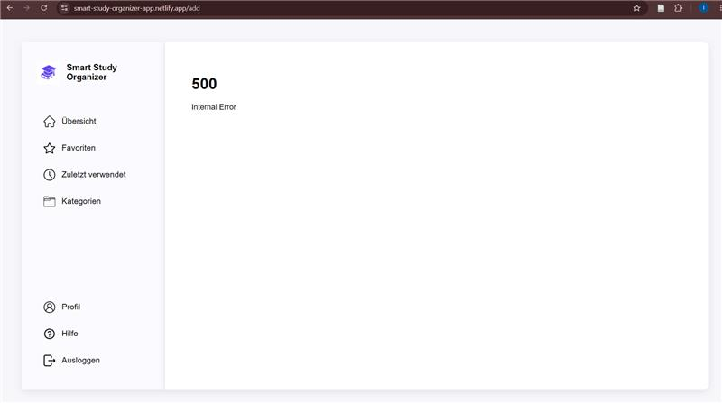

*Abbildung 19: Fehlermeldung nach dem hochladen*

#### Zusammenfassung der Resultate

Die Evaluation zeigte, dass die Benutzeroberfläche verständlich aufgebaut ist und die wichtigsten Funktionen ohne zusätzliche Unterstützung genutzt werden konnten. Navigation, Suche, Favoriten, Kategorien sowie die Profilfunktionen wurden von beiden Testpersonen positiv bewertet. Das einzige kritische Problem betraf den Dateiupload in der deployten Version. Insgesamt bestätigte die Evaluation die Benutzerfreundlichkeit und Zweckmässigkeit der Anwendung.

#### Abgeleitete Verbesserungen

| Priorität | Verbesserung | Status |
|------------|-------------|---------|
| Hoch | Cloudinary für Dateispeicherung integrieren | Umgesetzt |


Die wichtigste Erkenntnis der Evaluation war das Problem beim Dateiupload in der deployten Version. Dieses Problem wurde nach der Testphase analysiert und durch die Integration von Cloudinary behoben. Dadurch funktioniert das Hochladen, Bearbeiten und Verwalten von Lernmaterialien nun sowohl lokal als auch in der veröffentlichten Version der Anwendung.


## 4. Erweiterungen [Optional]
Dokumentiert Erweiterungen über den Mindestumfang hinaus.
> **Hinweis:** Jede Erweiterung ist separat nach dem folgenden Schema zu beschreiben.

### _[4.x Kurzbeschreibung / Titel]_  
- **Beschreibung & Nutzen:** _[Was wurde erweitert? Warum?]_  
- **Wo umgesetzt:** _[Wie und wo wurde es gemacht? Frontend, Backend, Datenbank?]_  
- **Referenz:** _[Wo wird die Erweiterung auch noch beschrieben, z.B. Screenshot oder Beschreibung in einem anderen Kapitel]_  
- **Aus Evaluation abgeleitet?:** _[Wurde diese Erweiterung als Folge eines in der Evaluation identifizierten Issues implementiert?]_  

> Das folgende **Beispiel** wurde bewusst kurz gehalten. Erweiterungen dürfen auch ausführlicher beschrieben werden.

### 4.1 Tabelle nach Kategorien filtern
- **Beschreibung & Nutzen:** Tabelle X kann nach Kategorie gefiltert werden, weil User typischerweise nur an einer bestimmten Kategorie interessiert sind.  
- **Wo umgesetzt:** 
  - **Frontend:** Tabelle mit Dropdown in Datei ...
  - **Backend:** Form Action ... in Datei ...
  - **Datenbank:** MongoDB-Query in Datei ...
- **Referenz:** Screenshot in Kap. x.y
- **Aus Evaluation abgeleitet?:** Ja, Issue x.y

## 5. Projektorganisation [Optional]
Beispiele:
- **Repository & Struktur:** _[Link; kurze Strukturübersicht]_  
- **Issue-Management:** _[Vorgehen kurz beschreiben]_  
- **Commit-Praxis:** _[z. B. sprechende Commits]_

## 6. KI-Deklaration
Die folgende Deklaration ist verpflichtend und beschreibt den Einsatz von KI im Projekt.

### 6.1 KI-Tools
- **Eingesetzte Tools**: _[z. B. Copilot, ChatGPT, Claude, lokale Modelle; Version/Variante wenn bekannt]_
- **Zweck & Umfang**: _[wie, wofür und in welchem Ausmass wurde KI eingesetzt (z. B. Textentwürfe, Codevorschläge, Tests, Refactoring); welche Teile stammen (ganz/teilweise) aus KI-Unterstützung?]_
- **Eigene Leistung (Abgrenzung):** _[was ist eigenständig erarbeitet/überarbeitet worden?]_

### 6.2 Prompt-Vorgehen
_[Überlegungen zu Prompt-Vorgehen, Qualität und Urheberrecht/Quellen. Wie wurde beim Prompting vorgegangen? Zu beschreiben ist die grundlegende Vorgehensweise. Einzelne, konkrete Prompts sollten höchstens als Beispiele aufgeführt werden. ]_

### 6.3 Reflexion
_[Nutzen, Grenzen, Risiken/Qualitätssicherung, ...]_

## 7. Anhang [Optional]
Beispiele:
- **Quellen:** _[verwendete Vorlagen/Assets/Modelle; Lizenz/Urheberrecht; ...]_
- **Testskript & Materialien:** _[Link/Datei]_  
- **Rohdaten/Auswertung:** _[Link/Datei]_  

